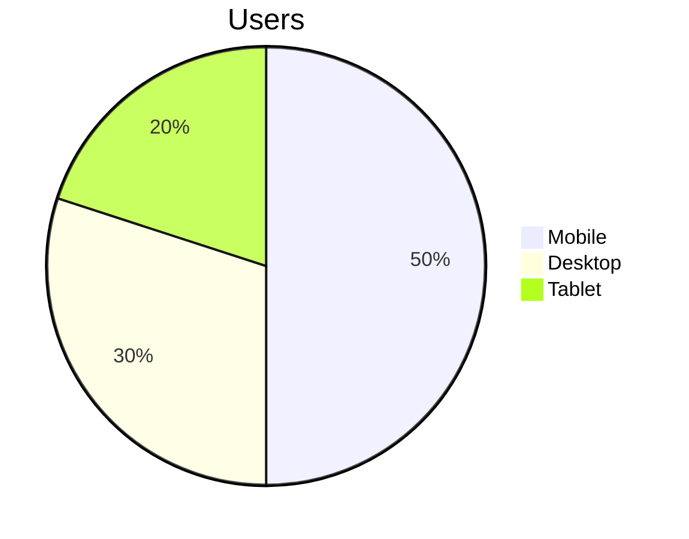
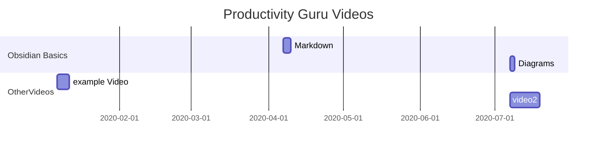

## Headings

# Heading1
## Heading2
### Heading3
#### Heading4
##### Heading5
###### Heading6

---

## Text Styling

**Bold1**
__Bold2__
*Italic1*
_Italic2_
~~Strike~~
==Highlights==

---

## Lists
Ordered list
1. x
2. a
3. b
	1. c
	2. d
	3. e
	4. f
4. g
5. h

Unordered Lists

- a
- b
- c
	- d
	- e
-f

---

## Links

1. External Links:
	1. https://Buzzerage.github.io
	2. [Buzzerage site](https://Buzzerage.github.io)
2. Internal Links:
	1. [[test2]]
	2. [[test2|testeo]]
3. Embedded:
	1. ![[test2]]
	2. ![[test2#Test 2]]
4. Images:
	1. 
	2. ![[707a026c8d9e34a916cbdcd56d18be3f1bffba5c.png]]
5. Audio Embeddiing:
	1. ![[Recording 20210413145539.webm]]
6. TEST
	1. ![[test.jpg]]
	2. 

---shot

## Quotes

> A nice quote by someone
\- Inside
- Outside

---


## Code Blocks

1.	Code Block:
``` py
import pandas as pd

df = pd.read_CSV("test.csv")
```

	This is another test
	sdfassadfsa
	
Template is sorted in `template.md`

---

## Todos

- [ ] Task1
- [x] Task2

---

## Tables

| Column 1 |  Column 2 | Column 3 |
|:--|:-:|--:|
|a|b|c|
|[[test2\|t2]]|te|to|

---

## Footnotes

This is a sentence [^a]

This is also a sentence [^beeee]

[^a]: This is a footnote
[^beeee]: Second footnote
This is also a part of the footnote

--- 

## Maths

$\ulcorner$$\mathbb{Productivity}$ $\mathbb{Guru}$$\lcorner$

$$\biggr(\begin{vmatrix} a & b\\
c & d
\end{vmatrix} = ad-bc\biggr)$$

$\infty$
$\longrightarrow$

--- 

## Pie Charts



## Graphs

### Diirection 

1.	Top to Bottom
	```mermaid
	graph TB
	A-->B
	```
2. Bottom to Top
	```mermaid
	graph BT
	A-->B
	```
3.	Left to Right
	```mermaid
	graph LR
	A-->B
	```
4. Right to Left
	```mermaid
	graph RL
	A-->B
	```

## Gantt Charts



